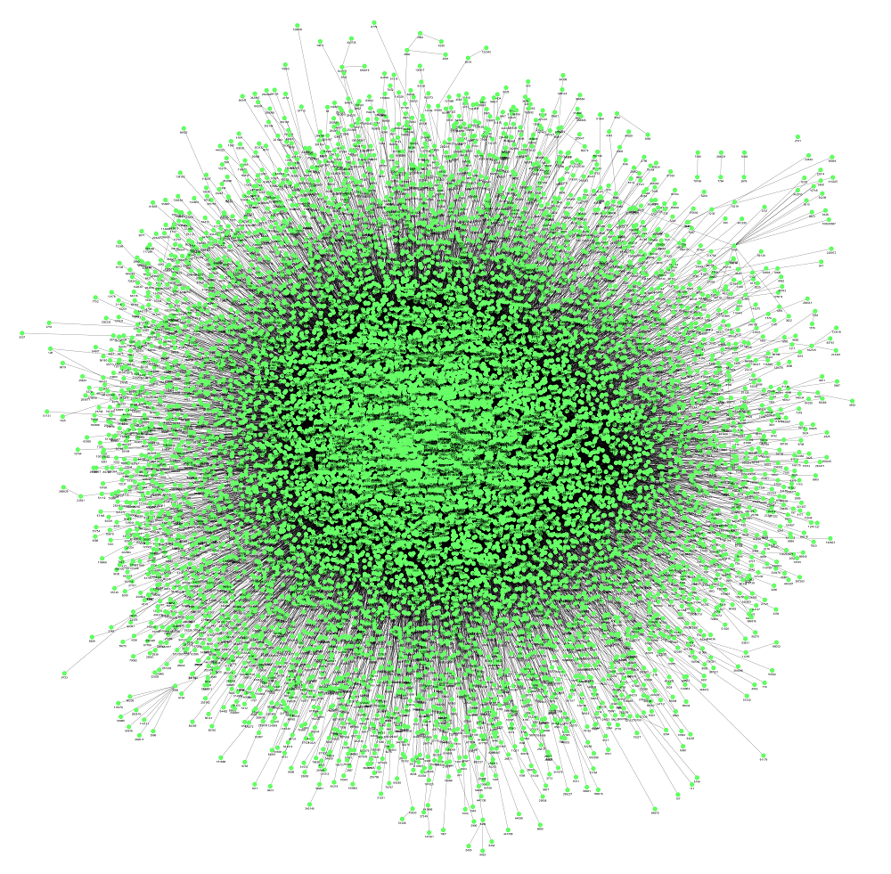
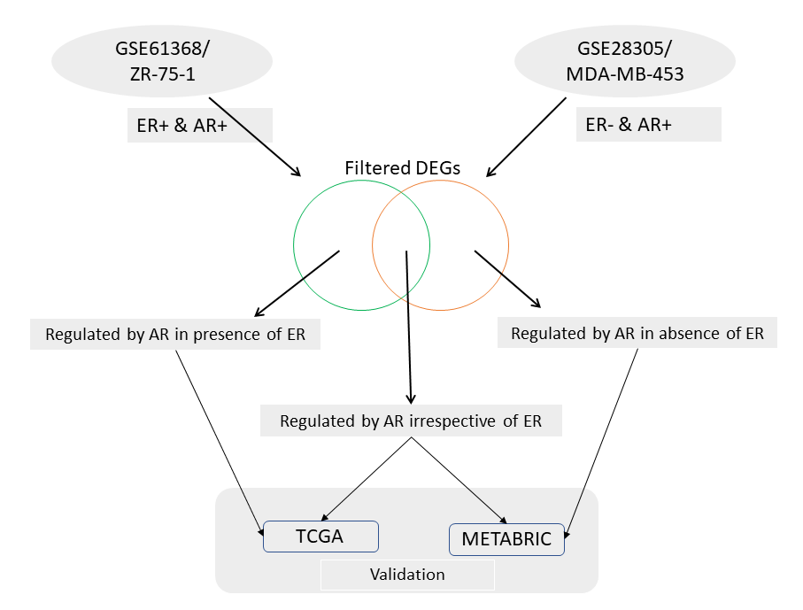
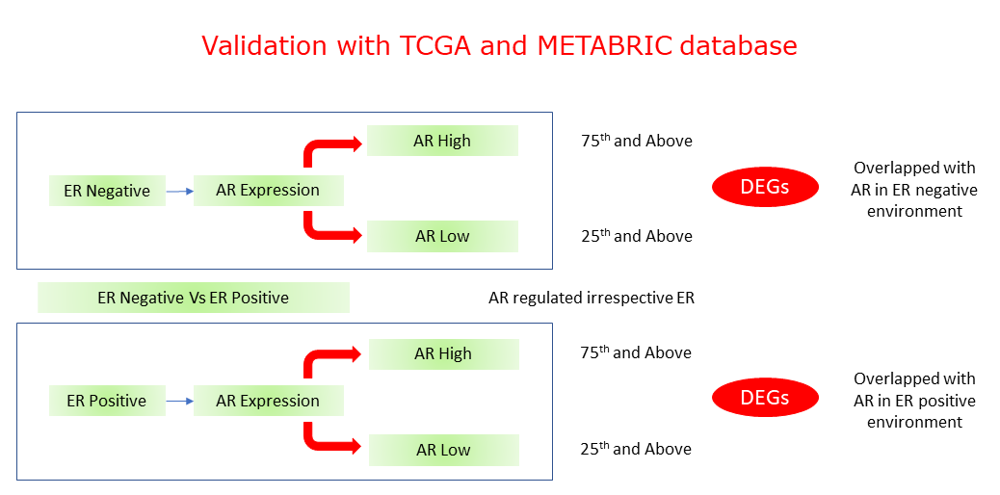

```python

```


```python

```


```python

```


```python

```


### 1. Selection of the base Genes
The curated genes from various studies related to the disease or condition of interest **(BASE GENES)**.

### 2. Collection of Gene Expression Data
The microarray gene expression profile of disease of interest was taken from the GEO database (www.ncbi.nlm.nih.gov/geo)

### 3. Data Normalization and Analysis
1. Analysis of microarray gene expression data was carried out by using R/Bioconductor. <br>
2. Normalization of the microarray dataset was performed using Quantile or Robust Multiarray Average (RMA) algorithm <br>
3. Statistically significant genes between control and treated samples were computed by applying t-statistic.<br>

### 4. Protein-Protein Interaction Map
An experimentally validated protein–protein interaction map **(PPIM)** was constructed using data deposited in the Biomolecular Interaction Network Database (**BIND**), Biological General Repository for Interaction Datasets (**BioGRID**), The Molecular Interaction Database (**MINT**), Database of Interacting Proteins (**DIP**), Human Protein Reference Database (**HPRD**), and **IntAct** database. <br><br>In the current analysis we used data from [HIPPIE database](http://cbdm-01.zdv.uni-mainz.de/~mschaefer/hippie/) was used. [Gregorio et al., 2017](https://doi.org/10.1093/nar/gkw985); [Martin et al., 2012](https://dx.doi.org/10.1371%2Fjournal.pone.0031826).<br> All the significant gene's (p<=0.05) + base genes from our analysis was overlapped with HIPPIE database to derive the PPIM

### 5. Toplogical parameters (Using Cytoscape)
Apply topological parameters (Degree, betweenness) based on Graph theory to subset the genes as hubs and bottlenecks. Degree represnts the connectivity of a gene in the network.<br>
Mean Degree across the genes were calculated = M <br>
Standrd deviation of the degree across genes were calculated = SD <br>

**Hubs = M + (2 x SD)** [Fiona et al 2015](https://bmcgenomics.biomedcentral.com/articles/10.1186/1471-2164-16-S9-S2)<br>

### 6. Construction of Sub-Network
The subnetwork (**SPIN**) was created by extracting "Hubs", **BASE GENES** and their connected partners from the PPIM.

### 7. Identification of pairwise gene correlation
Pearson’s correlation algorithm was applied to the genes of 'Sub-Network' to create a weighted gene correlation map based on Pearson's Correlation Coefficient (PCC).In this approach, PCC between the gene-gene pairs in **SPIN** was generated for both control and treated group separately. Next, the difference of PCC (DPCC) between gene pairs of disease and control group. Higher DPCC score implies distinct variation in gene’s interaction from control to treated condition


### 8. Semantic Similarity Between Gene Pairs
It has been observed that genes involved in phenotypically similar diseases are often functionally related on the molecular level [Schlicker et al., 2010](https://dx.doi.org/10.1093%2Fbioinformatics%2Fbtq384)<br><br>
Functional resemblance among two genes is evaluated using prearranged data available in Gene Ontology.<br><br> To evaluate the functional similarity between two genes, Wang’s measure of semantic similarity was applied to molecular function (MF) hierarchy as MF, which specifically defines a particular gene in terms of functional ontology.<br><br> Since a gene can be annotated by many GO terms, we used Best-Match Average (BMA) method which combine semantic similarity scores of several GO terms and calculates the average of all maximum similarities on each row and column
<br><br>The semantic score of functional similarity between genes range from 0 to 1. Higher semantic score between genes represents a stronger functional relationship among the genes

### 9. Extracting the gene pairs with Fold Change
Consider the interactions, fold change in bracket, <br><br>
"IL6 (1.5)  =::=  TNF (0.5)" <br>
"IL6 (1.5)  =::=  VEGFA (2.5)" <br>
"ATM (0.3)  =::=  TNF (0.5)" <br>
"ATM (0.3)  =::=  IL6 (1.5)" <br>
"ATM (0.3)  =::=  SPP1 (0.2)" <br>

If one of the gene in the interaction falls under the cut-off of FoldChnage threshold (viz. 1.5) those pair of genes are considered. After applying the cutoff the following gene pairs are obtained.<br>

"IL6 (1.5) :: TNF (0.5)" <br>
"IL6 (1.5) :: VEGFA (2.5)" <br>
"ATM (0.3) :: IL6 (1.5)" <br>
<br>
This was done to include the genes that shares similar function with a deregulated genes for functional enrichment analysis
### 10. Isolated genes with high differential expression
There may be some genes which are highly differentially expressed but get removed due to lack of connectivity (isolated node) or some other parameters in the filter. <br> To retain these genes in the list, **absolute fold change** with specific threshold was screened from the initial list of significant genes from **step 3**.
Next, genes which falls under top 75 quantile were screened and included in the final list. There can be many overlap with the genes screened at **step 9**


```python
import pandas as pd
import os
import matplotlib.pyplot as plt
import matplotlib.mlab as mlab
from bioinfokit import analys, visuz
```


```python
os.chdir(r'D:\AR_validation')
```


```python
base_genes = pd.read_table("genes_base.txt")
print(len(base_genes), "base genes")
base_genes.head()
```

    305 base genes
    


<div>
<style scoped>
    .dataframe tbody tr th:only-of-type {
        vertical-align: middle;
    }

    .dataframe tbody tr th {
        vertical-align: top;
    }

    .dataframe thead th {
        text-align: right;
    }
</style>
<table border="1" class="dataframe">
  <thead>
    <tr style="text-align: right;">
      <th></th>
      <th>GeneID</th>
      <th>EntrezID</th>
      <th>GeneName</th>
    </tr>
  </thead>
  <tbody>
    <tr>
      <th>0</th>
      <td>DOCK10</td>
      <td>55619</td>
      <td>dedicator of cytokinesis 10</td>
    </tr>
    <tr>
      <th>1</th>
      <td>SCIN</td>
      <td>85477</td>
      <td>scinderin</td>
    </tr>
    <tr>
      <th>2</th>
      <td>CBLN2</td>
      <td>147381</td>
      <td>cerebellin 2 precursor</td>
    </tr>
    <tr>
      <th>3</th>
      <td>CD9</td>
      <td>928</td>
      <td>CD9 molecule</td>
    </tr>
    <tr>
      <th>4</th>
      <td>PIP</td>
      <td>5304</td>
      <td>prolactin induced protein</td>
    </tr>
  </tbody>
</table>
</div>


#### Data set information

Cells were cotreated with **dihydrotestosterone** (DHT) and **estrdiol** (E2) to assess the combinatorial effects of hormone exposure in breast cancer cells<br>

GSE ID : [GSE61368](https://www.ncbi.nlm.nih.gov/geo/query/acc.cgi?acc=GSE61368)


```python
sample = pd.read_table("sample_info.txt")
print(sample.shape)
sample.head()
```

    (16, 2)
    


<div>
<style scoped>
    .dataframe tbody tr th:only-of-type {
        vertical-align: middle;
    }

    .dataframe tbody tr th {
        vertical-align: top;
    }

    .dataframe thead th {
        text-align: right;
    }
</style>
<table border="1" class="dataframe">
  <thead>
    <tr style="text-align: right;">
      <th></th>
      <th>SAMPLE_ID</th>
      <th>SAMPLE_NAME</th>
    </tr>
  </thead>
  <tbody>
    <tr>
      <th>0</th>
      <td>GSM1503194</td>
      <td>ZR751_VC_rep4</td>
    </tr>
    <tr>
      <th>1</th>
      <td>GSM1503207</td>
      <td>ZR751_VC_rep3</td>
    </tr>
    <tr>
      <th>2</th>
      <td>GSM1503181</td>
      <td>ZR751_VC_rep2</td>
    </tr>
    <tr>
      <th>3</th>
      <td>GSM1503183</td>
      <td>ZR751_VC_rep1</td>
    </tr>
    <tr>
      <th>4</th>
      <td>GSM1503209</td>
      <td>ZR751_E2s_rep4</td>
    </tr>
  </tbody>
</table>
</div>


#### Gene Expression Profile
Data are normalized using Quantile Normalization.<br>
In the initial stage of analysis we compared the **DHT** treatment against **Control** samples.<br>
Differential expression analysis between `DHT` and `Control` samples was conducted using `limma` R package


```python
#differential expression between dht and control
dht_data = pd.read_table("gene_expression.txt", sep='\t')
#Selecting the significant genes and base genes (regardless of any other parameters)
selected=dht_data[(dht_data['p.value'] < 0.05) | (dht_data['Base_Genes'] ==1)]
selected
```


<div>
<style scoped>
    .dataframe tbody tr th:only-of-type {
        vertical-align: middle;
    }

    .dataframe tbody tr th {
        vertical-align: top;
    }

    .dataframe thead th {
        text-align: right;
    }
</style>
<table border="1" class="dataframe">
  <thead>
    <tr style="text-align: right;">
      <th></th>
      <th>Entrez_ID</th>
      <th>Symbol</th>
      <th>FoldChange</th>
      <th>p.value</th>
      <th>Base_Genes</th>
    </tr>
  </thead>
  <tbody>
    <tr>
      <th>0</th>
      <td>1794</td>
      <td>DOCK2</td>
      <td>-4.90</td>
      <td>6.260000e-10</td>
      <td>0</td>
    </tr>
    <tr>
      <th>1</th>
      <td>147381</td>
      <td>CBLN2</td>
      <td>-2.74</td>
      <td>1.440000e-06</td>
      <td>1</td>
    </tr>
    <tr>
      <th>2</th>
      <td>25928</td>
      <td>SOSTDC1</td>
      <td>-1.88</td>
      <td>3.090000e-05</td>
      <td>0</td>
    </tr>
    <tr>
      <th>3</th>
      <td>91523</td>
      <td>FAM113B</td>
      <td>-1.83</td>
      <td>6.810000e-05</td>
      <td>0</td>
    </tr>
    <tr>
      <th>4</th>
      <td>8555</td>
      <td>CDC14B</td>
      <td>-1.80</td>
      <td>2.120692e-02</td>
      <td>0</td>
    </tr>
    <tr>
      <th>...</th>
      <td>...</td>
      <td>...</td>
      <td>...</td>
      <td>...</td>
      <td>...</td>
    </tr>
    <tr>
      <th>25181</th>
      <td>7365</td>
      <td>UGT2B10</td>
      <td>4.46</td>
      <td>5.740000e-14</td>
      <td>0</td>
    </tr>
    <tr>
      <th>25182</th>
      <td>9073</td>
      <td>CLDN8</td>
      <td>4.91</td>
      <td>2.760000e-10</td>
      <td>0</td>
    </tr>
    <tr>
      <th>25183</th>
      <td>54490</td>
      <td>UGT2B28</td>
      <td>16.23</td>
      <td>5.720000e-18</td>
      <td>0</td>
    </tr>
    <tr>
      <th>25184</th>
      <td>7364</td>
      <td>UGT2B7</td>
      <td>20.42</td>
      <td>1.020000e-18</td>
      <td>0</td>
    </tr>
    <tr>
      <th>25185</th>
      <td>10720</td>
      <td>UGT2B11</td>
      <td>22.67</td>
      <td>5.460000e-20</td>
      <td>0</td>
    </tr>
  </tbody>
</table>
<p>2853 rows × 5 columns</p>
</div>


```python
#protein interactions from experimentally validated database hippie
hippie = pd.read_table("hippie_current.txt", sep='\t', low_memory=False)
print(len(hippie)/2, "protein interactions") #contains 'a-b' and 'b-a' interactions considered only 'a-b' or 'b-a' interactions
hippie.head(4)
```

    411430.0 protein interactions
    


<div>
<style scoped>
    .dataframe tbody tr th:only-of-type {
        vertical-align: middle;
    }

    .dataframe tbody tr th {
        vertical-align: top;
    }

    .dataframe thead th {
        text-align: right;
    }
</style>
<table border="1" class="dataframe">
  <thead>
    <tr style="text-align: right;">
      <th></th>
      <th>Gene1</th>
      <th>EntrezID1</th>
      <th>Gene2</th>
      <th>EntrezID2</th>
      <th>Score</th>
      <th>Reference</th>
    </tr>
  </thead>
  <tbody>
    <tr>
      <th>0</th>
      <td>AL1A1_HUMAN</td>
      <td>216</td>
      <td>AL1A1_HUMAN</td>
      <td>216</td>
      <td>0.76</td>
      <td>experiments:in vivo,Two-hybrid;pmids:12081471,...</td>
    </tr>
    <tr>
      <th>1</th>
      <td>ITA7_HUMAN</td>
      <td>3679</td>
      <td>ACHA_HUMAN</td>
      <td>1134</td>
      <td>0.73</td>
      <td>experiments:in vivo,Affinity Capture-Western,a...</td>
    </tr>
    <tr>
      <th>2</th>
      <td>NEB1_HUMAN</td>
      <td>55607</td>
      <td>ACTG_HUMAN</td>
      <td>71</td>
      <td>0.65</td>
      <td>experiments:in vitro,in vivo;pmids:9362513,120...</td>
    </tr>
    <tr>
      <th>3</th>
      <td>SRGN_HUMAN</td>
      <td>5552</td>
      <td>CD44_HUMAN</td>
      <td>960</td>
      <td>0.63</td>
      <td>experiments:in vivo;pmids:9334256,16189514,167...</td>
    </tr>
  </tbody>
</table>
</div>


```python
# Histogram: Distribution of interaction data with corresponding scores
hippie['Score'].hist(bins=10, figsize=[10,5], facecolor='indigo')
#more data lies with score 0.4 and above hence considerd interaction that has an edge weight >= 0.4
```


    <AxesSubplot:>


    

    


```python
hippie = hippie[hippie['Score']>=0.4]
hippie.head(4) #There are about 405704 protein-protein interactions with score 0.4 and above
```


<div>
<style scoped>
    .dataframe tbody tr th:only-of-type {
        vertical-align: middle;
    }

    .dataframe tbody tr th {
        vertical-align: top;
    }

    .dataframe thead th {
        text-align: right;
    }
</style>
<table border="1" class="dataframe">
  <thead>
    <tr style="text-align: right;">
      <th></th>
      <th>Gene1</th>
      <th>EntrezID1</th>
      <th>Gene2</th>
      <th>EntrezID2</th>
      <th>Score</th>
      <th>Reference</th>
    </tr>
  </thead>
  <tbody>
    <tr>
      <th>0</th>
      <td>AL1A1_HUMAN</td>
      <td>216</td>
      <td>AL1A1_HUMAN</td>
      <td>216</td>
      <td>0.76</td>
      <td>experiments:in vivo,Two-hybrid;pmids:12081471,...</td>
    </tr>
    <tr>
      <th>1</th>
      <td>ITA7_HUMAN</td>
      <td>3679</td>
      <td>ACHA_HUMAN</td>
      <td>1134</td>
      <td>0.73</td>
      <td>experiments:in vivo,Affinity Capture-Western,a...</td>
    </tr>
    <tr>
      <th>2</th>
      <td>NEB1_HUMAN</td>
      <td>55607</td>
      <td>ACTG_HUMAN</td>
      <td>71</td>
      <td>0.65</td>
      <td>experiments:in vitro,in vivo;pmids:9362513,120...</td>
    </tr>
    <tr>
      <th>3</th>
      <td>SRGN_HUMAN</td>
      <td>5552</td>
      <td>CD44_HUMAN</td>
      <td>960</td>
      <td>0.63</td>
      <td>experiments:in vivo;pmids:9334256,16189514,167...</td>
    </tr>
  </tbody>
</table>
</div>


```python
#Extracting all interactions of selected data
ppi = hippie[hippie['EntrezID1'].isin(selected['Entrez_ID']) | hippie['EntrezID2'].isin(selected['Entrez_ID'])]
ppi.to_csv("DHT_ppi.txt", sep="\t", index=False)
ppi.head() #112282 interactions
```


<div>
<style scoped>
    .dataframe tbody tr th:only-of-type {
        vertical-align: middle;
    }

    .dataframe tbody tr th {
        vertical-align: top;
    }

    .dataframe thead th {
        text-align: right;
    }
</style>
<table border="1" class="dataframe">
  <thead>
    <tr style="text-align: right;">
      <th></th>
      <th>Gene1</th>
      <th>EntrezID1</th>
      <th>Gene2</th>
      <th>EntrezID2</th>
      <th>Score</th>
      <th>Reference</th>
    </tr>
  </thead>
  <tbody>
    <tr>
      <th>4</th>
      <td>GRB7_HUMAN</td>
      <td>2886</td>
      <td>ERBB2_HUMAN</td>
      <td>2064</td>
      <td>0.90</td>
      <td>experiments:in vitro,in vivo,Reconstituted Com...</td>
    </tr>
    <tr>
      <th>5</th>
      <td>PAK1_HUMAN</td>
      <td>5058</td>
      <td>ERBB2_HUMAN</td>
      <td>2064</td>
      <td>0.73</td>
      <td>experiments:in vivo,Affinity Capture-Western,a...</td>
    </tr>
    <tr>
      <th>6</th>
      <td>DLG4_HUMAN</td>
      <td>1742</td>
      <td>ERBB2_HUMAN</td>
      <td>2064</td>
      <td>0.87</td>
      <td>experiments:in vivo,Two-hybrid,Affinity Captur...</td>
    </tr>
    <tr>
      <th>7</th>
      <td>P85B_HUMAN</td>
      <td>5296</td>
      <td>ERBB2_HUMAN</td>
      <td>2064</td>
      <td>0.89</td>
      <td>experiments:in vivo,Reconstituted Complex,Bioc...</td>
    </tr>
    <tr>
      <th>8</th>
      <td>PTN18_HUMAN</td>
      <td>26469</td>
      <td>ERBB2_HUMAN</td>
      <td>2064</td>
      <td>0.88</td>
      <td>experiments:in vitro,pull down,anti tag coimmu...</td>
    </tr>
  </tbody>
</table>
</div>


### The file was imported to cytoscape to create the protein protein interaction network



node = 'network_parameter_file.txt'


```python
#hub formula
hub = node['Degree'].mean()  + 2*(node['Degree'].std()) #where node contains network properties from cytoscape
hub = hub.round(0)
```

**Next, PPI was decomposed to a subnetwork using `hub + partners` and `base genes + partners`.**


**Next semantic similarity of the gene pairs from the subnetwork was calculated using `GOSemSim` package in R**

```
library(GOSemSim)
library(org.Hs.eg.db)
library(data.table) 

#Load the GO data
hsGO2 <- godata('org.Hs.eg.db',  ont="BP", computeIC=FALSE)

#Loading genes list to variable gene   
data <- read.table(file = "gene_std_list.txt",header = T) #gene list to perform semantic similarity

#storing in data structure data.table 
data < -as.data.table(data)

#converting the genesID(integer) to character type.
newdata <- data[,ID:=as.character(Entrez)]

#Execute the Semantic Analysis
result <- mgeneSim(newdata$ID,semData=hsGO2, measure="Wang",combine="BMA",verbose=FALSE)

#result matrix storing in dataframe.
res <- as.data.frame(as.table(result))

#writing the result to file
write.table(res,"result_bp.txt",quote = F,sep="\t")

```


```python
#Semantic Similarity
semantic_similarity = pd.read_table("edge_semantic_map.txt", sep='\t') #semantic similarity mapped to gene pairs
#semantic_similarity.rename(columns = {'Var1':'Gene-1', 'Var2':'Gene-2'}, inplace = True)
#Consider the gene pairs with higher semantic score 0.5
semantic_similarity_sel = semantic_similarity[semantic_similarity['Freq'] >= 0.5]
semantic_similarity_sel
```


<div>
<style scoped>
    .dataframe tbody tr th:only-of-type {
        vertical-align: middle;
    }

    .dataframe tbody tr th {
        vertical-align: top;
    }

    .dataframe thead th {
        text-align: right;
    }
</style>
<table border="1" class="dataframe">
  <thead>
    <tr style="text-align: right;">
      <th></th>
      <th>Gene-1</th>
      <th>Gene-2</th>
      <th>Gene1FC</th>
      <th>Gene2FC</th>
      <th>Freq</th>
    </tr>
  </thead>
  <tbody>
    <tr>
      <th>0</th>
      <td>7163</td>
      <td>2026</td>
      <td>1.416390</td>
      <td>1.143308</td>
      <td>0.635</td>
    </tr>
    <tr>
      <th>1</th>
      <td>7163</td>
      <td>8339</td>
      <td>1.416390</td>
      <td>1.250801</td>
      <td>0.711</td>
    </tr>
    <tr>
      <th>2</th>
      <td>7163</td>
      <td>999</td>
      <td>1.416390</td>
      <td>-1.220840</td>
      <td>0.864</td>
    </tr>
    <tr>
      <th>4</th>
      <td>6652</td>
      <td>1410</td>
      <td>1.378976</td>
      <td>1.260996</td>
      <td>0.596</td>
    </tr>
    <tr>
      <th>5</th>
      <td>7163</td>
      <td>813</td>
      <td>1.416390</td>
      <td>-1.155626</td>
      <td>0.883</td>
    </tr>
    <tr>
      <th>...</th>
      <td>...</td>
      <td>...</td>
      <td>...</td>
      <td>...</td>
      <td>...</td>
    </tr>
    <tr>
      <th>36842</th>
      <td>999</td>
      <td>8021</td>
      <td>-1.220840</td>
      <td>-1.323281</td>
      <td>0.668</td>
    </tr>
    <tr>
      <th>36844</th>
      <td>261726</td>
      <td>6652</td>
      <td>1.177023</td>
      <td>1.378976</td>
      <td>0.815</td>
    </tr>
    <tr>
      <th>36845</th>
      <td>3326</td>
      <td>81788</td>
      <td>-1.282545</td>
      <td>-1.267591</td>
      <td>0.615</td>
    </tr>
    <tr>
      <th>36846</th>
      <td>51755</td>
      <td>9128</td>
      <td>-1.185291</td>
      <td>-1.396057</td>
      <td>0.523</td>
    </tr>
    <tr>
      <th>36847</th>
      <td>4771</td>
      <td>81847</td>
      <td>-1.150655</td>
      <td>1.243495</td>
      <td>1.000</td>
    </tr>
  </tbody>
</table>
<p>26128 rows × 5 columns</p>
</div>


```python
#Filter using fold change threshold: one among the genes having the fold change >= 1.4
test = semantic_similarity_sel.copy()
test = test[(test.Gene1FC >= abs(1.4)) | (test.Gene2FC >= abs(1.4))]
test
```


<div>
<style scoped>
    .dataframe tbody tr th:only-of-type {
        vertical-align: middle;
    }

    .dataframe tbody tr th {
        vertical-align: top;
    }

    .dataframe thead th {
        text-align: right;
    }
</style>
<table border="1" class="dataframe">
  <thead>
    <tr style="text-align: right;">
      <th></th>
      <th>Gene-1</th>
      <th>Gene-2</th>
      <th>Gene1FC</th>
      <th>Gene2FC</th>
      <th>Freq</th>
    </tr>
  </thead>
  <tbody>
    <tr>
      <th>0</th>
      <td>7163</td>
      <td>2026</td>
      <td>1.416390</td>
      <td>1.143308</td>
      <td>0.635</td>
    </tr>
    <tr>
      <th>1</th>
      <td>7163</td>
      <td>8339</td>
      <td>1.416390</td>
      <td>1.250801</td>
      <td>0.711</td>
    </tr>
    <tr>
      <th>2</th>
      <td>7163</td>
      <td>999</td>
      <td>1.416390</td>
      <td>-1.220840</td>
      <td>0.864</td>
    </tr>
    <tr>
      <th>5</th>
      <td>7163</td>
      <td>813</td>
      <td>1.416390</td>
      <td>-1.155626</td>
      <td>0.883</td>
    </tr>
    <tr>
      <th>25</th>
      <td>4593</td>
      <td>2289</td>
      <td>1.392378</td>
      <td>3.246326</td>
      <td>0.591</td>
    </tr>
    <tr>
      <th>...</th>
      <td>...</td>
      <td>...</td>
      <td>...</td>
      <td>...</td>
      <td>...</td>
    </tr>
    <tr>
      <th>36681</th>
      <td>6160</td>
      <td>6730</td>
      <td>1.498675</td>
      <td>-1.225987</td>
      <td>0.752</td>
    </tr>
    <tr>
      <th>36743</th>
      <td>832</td>
      <td>4645</td>
      <td>1.440226</td>
      <td>-1.238395</td>
      <td>0.643</td>
    </tr>
    <tr>
      <th>36771</th>
      <td>10768</td>
      <td>5805</td>
      <td>-1.174459</td>
      <td>1.765138</td>
      <td>0.832</td>
    </tr>
    <tr>
      <th>36815</th>
      <td>10204</td>
      <td>5547</td>
      <td>1.412421</td>
      <td>-1.214452</td>
      <td>0.543</td>
    </tr>
    <tr>
      <th>36838</th>
      <td>79026</td>
      <td>998</td>
      <td>1.857973</td>
      <td>-1.175166</td>
      <td>0.575</td>
    </tr>
  </tbody>
</table>
<p>3504 rows × 5 columns</p>
</div>


**Considering genes with Higher Differential Expression**<br>
Genes which falls in top 75 quantile of the fold change threshold were screened and included in the final list.
Further, all duplicate genes were removed and sorted in descending order of fold change.<br>
We obtained 250 genes prioritized for dht vs control comparison


```python
final_dht = pd.read_table("final_filtered_dht.txt", sep='\t')
final_dht
```


<div>
<style scoped>
    .dataframe tbody tr th:only-of-type {
        vertical-align: middle;
    }

    .dataframe tbody tr th {
        vertical-align: top;
    }

    .dataframe thead th {
        text-align: right;
    }
</style>
<table border="1" class="dataframe">
  <thead>
    <tr style="text-align: right;">
      <th></th>
      <th>EntrezID</th>
      <th>Name</th>
      <th>DHT_FC</th>
    </tr>
  </thead>
  <tbody>
    <tr>
      <th>0</th>
      <td>7364</td>
      <td>UGT2B7</td>
      <td>21.933067</td>
    </tr>
    <tr>
      <th>1</th>
      <td>10720</td>
      <td>UGT2B11</td>
      <td>22.670194</td>
    </tr>
    <tr>
      <th>2</th>
      <td>54490</td>
      <td>UGT2B28</td>
      <td>16.227830</td>
    </tr>
    <tr>
      <th>3</th>
      <td>79098</td>
      <td>C1orf116</td>
      <td>7.163982</td>
    </tr>
    <tr>
      <th>4</th>
      <td>7069</td>
      <td>THRSP</td>
      <td>3.635009</td>
    </tr>
    <tr>
      <th>...</th>
      <td>...</td>
      <td>...</td>
      <td>...</td>
    </tr>
    <tr>
      <th>245</th>
      <td>11031</td>
      <td>RAB31</td>
      <td>1.472256</td>
    </tr>
    <tr>
      <th>246</th>
      <td>29128</td>
      <td>UHRF1</td>
      <td>-1.449544</td>
    </tr>
    <tr>
      <th>247</th>
      <td>64919</td>
      <td>BCL11B</td>
      <td>-1.535156</td>
    </tr>
    <tr>
      <th>248</th>
      <td>85477</td>
      <td>SCIN</td>
      <td>-1.467557</td>
    </tr>
    <tr>
      <th>249</th>
      <td>1794</td>
      <td>DOCK2</td>
      <td>-4.895640</td>
    </tr>
  </tbody>
</table>
<p>250 rows × 3 columns</p>
</div>


**Similar strategy was performed for estrdiol and E2+DHT**: treatments
`229` and `328` genes were respectively prioritized for `E2` and `E2+DHT` treatments.

The cell line `MDA-MB-453` dataset with series identifier `GSE28305` was run through the same pipeline and compared with cell line `cell line ZR-75-1` (GSE61368)


```python

```


```python

```


```python

```


```python

```
